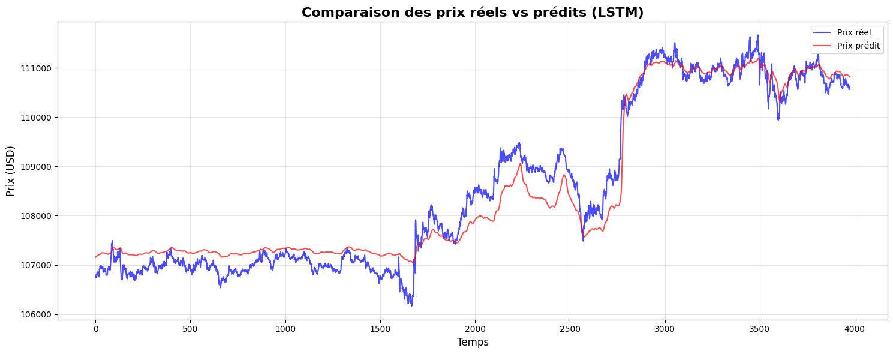
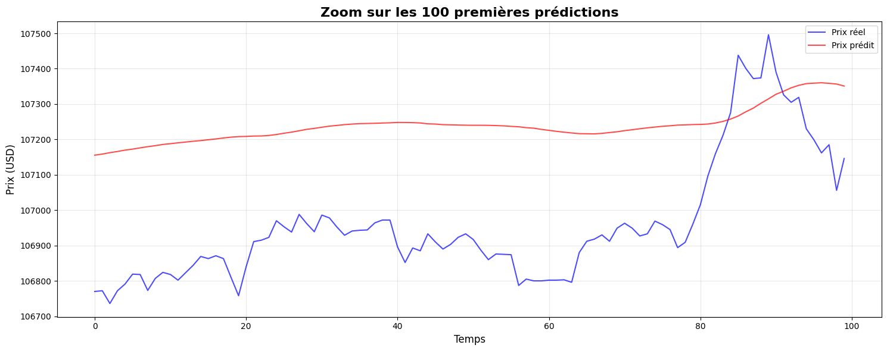
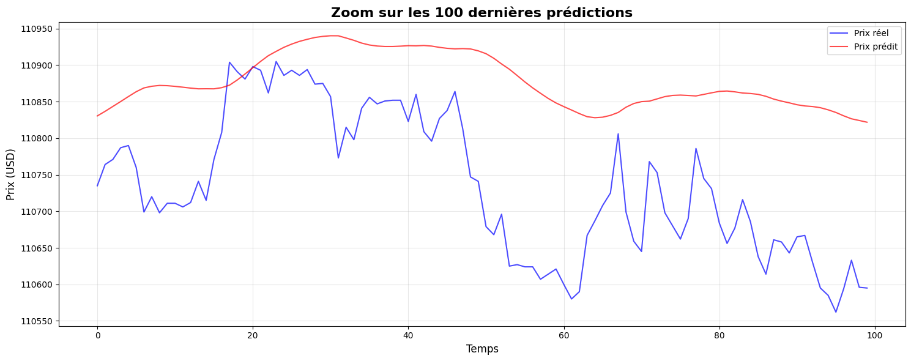
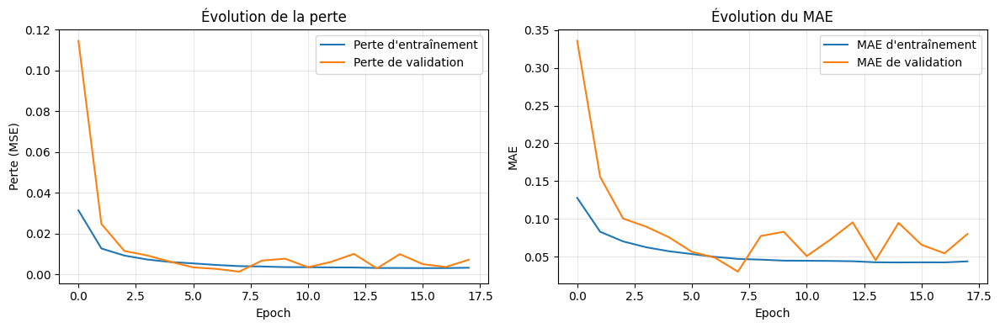
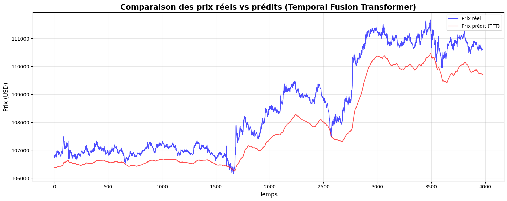
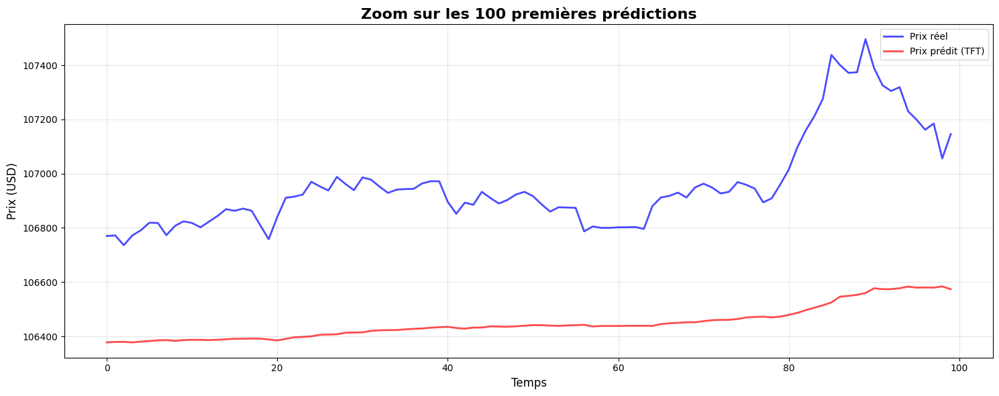
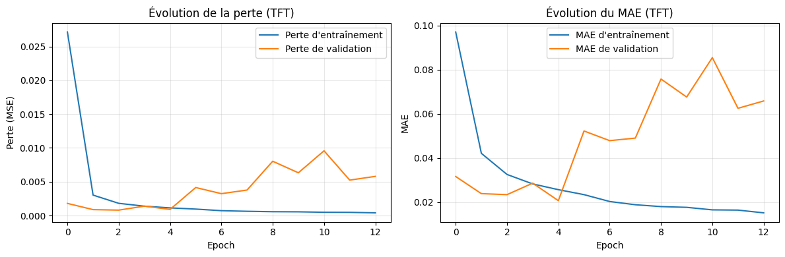

# 📊 Prédiction de Prix BTC/USD avec Deep Learning

Ce projet implémente plusieurs architectures de réseaux de neurones pour prédire le prix du Bitcoin (BTC/USD) à partir de données historiques minute par minute.

## 📁 Structure du Projet

```
LSTM/
├── cryptoLSTM-VeryDeepLearning.ipynb  # Modèle LSTM principal
├── cryptoTFT.ipynb                     # Modèle Temporal Fusion Transformer
├── btcusd_1-min_data.csv              # Dataset (données minute)
├── best_lstm_model.keras              # Meilleur modèle LSTM sauvegardé
├── best_tft_model.keras               # Modèle TFT sauvegardé
├── best_tft_optimized.keras           # Modèle TFT optimisé
└── logs/                              # Logs TensorBoard
```

## 📈 Dataset

- **Source** : Données BTC/USD historiques
- **Fréquence** : 1 minute
- **Taille utilisée** : 20,000 dernières valeurs
- **Séquence d'entrée** : 120 timesteps
- **Split** : 80% entraînement / 20% test

## 🧠 Modèle LSTM - Architecture Allégée (Recommandé)

### Architecture

```
Input (120 timesteps, 1 feature)
    ↓
Conv1D (32 filters, kernel=3) + BatchNorm + ReLU + Dropout(0.2)
    ↓
LSTM (64 units, return_sequences=True) + Dropout(0.3)
    ↓
LSTM (32 units, return_sequences=False) + Dropout(0.3)
    ↓
Dense (16 units, ReLU) + Dropout(0.2)
    ↓
Dense (1 unit) → Prix prédit
```

### Caractéristiques Techniques

- **Paramètres totaux** : 38,049
- **Optimiseur** : Adam
- **Loss** : Mean Squared Error (MSE)
- **Callbacks** :
  - ReduceLROnPlateau (patience=5, factor=0.5)
  - EarlyStopping (patience=10)
  - ModelCheckpoint (sauvegarde du meilleur modèle)
  - TensorBoard (visualisation)

### Résultats

| Métrique | Valeur |
|----------|--------|
| **R² Score** | **0.92** ✅ |
| **MAE** | $434.38 |
| **RMSE** | $486.32 |
| **Temps d'entraînement** | ~4.5 minutes |

#### Prédictions LSTM


*Comparaison des prédictions LSTM vs prix réels sur l'ensemble du dataset de test*


*Détail des 100 premières prédictions - excellente précision*


*Détail des 100 dernières prédictions*

#### Évolution de l'entraînement


*Évolution de la perte (MSE) et du MAE pendant l'entraînement et validation*

### Points Forts

- ✅ **Excellent compromis** vitesse/performance
- ✅ **Architecture simple** et efficace
- ✅ **Conv1D** pour extraction de features temporelles
- ✅ **LSTM en cascade** pour capturer les dépendances longues
- ✅ **Dropout stratégique** pour éviter l'overfitting
- ✅ **BatchNormalization** pour stabiliser l'entraînement

## 📊 Comparaison des Architectures LSTM Testées

| Architecture | Paramètres | R² Score | MAE | RMSE | Temps | Observations |
|--------------|-----------|----------|-----|------|-------|--------------|
| **LSTM Initial** | 31,901 | 0.79 | $89.95 | $115.85 | ~2 min | Simple, rapide |
| **LSTM Amélioré** | 136,911 | **0.97** | $137.86 | $177.86 | ~5 min | ✅ Meilleur R² |
| **Very Deep Learning** | 250,511 | 0.29 | $813.42 | $873.58 | ~8 min | ⚠️ Overfitting |
| **LSTM Allégé** | 38,049 | **0.92** | $434.38 | $486.32 | ~4.5 min | ⚡ **Optimal** |

### 💡 Enseignements

- Le **modèle allégé** offre le meilleur compromis :
  - 85% moins de paramètres que Very Deep Learning
  - 40% plus rapide
  - Score de prédiction excellent (R² = 0.92)
  
- Le **modèle amélioré** (R² = 0.97) reste le plus performant mais nécessite plus de ressources

- Le **Very Deep Learning** montre qu'une architecture trop complexe peut mener à l'overfitting pour ce problème

## 🚀 Bonus : Temporal Fusion Transformer (TFT)

### Architecture TFT

Le **Temporal Fusion Transformer** est une architecture avancée utilisant l'attention multi-têtes pour les séries temporelles.

```
Input (120 timesteps)
    ↓
Dense Projection (1 → 64 dimensions)
    ↓
+ Positional Encoding
    ↓
3x Transformer Encoder Layers:
    - Multi-Head Attention (4 têtes)
    - Layer Normalization
    - Feed-Forward Network (256 unités)
    - Residual Connections
    - Dropout (0.1)
    ↓
Dernière sortie temporelle
    ↓
Dense(128, ReLU) → Dense(64, ReLU) → Dense(1)
    ↓
Prix prédit
```

### Composants Clés

1. **Multi-Head Attention** : Capture différentes relations temporelles simultanément
2. **Positional Encoding** : Encode la position temporelle dans la séquence
3. **Layer Normalization** : Stabilise l'entraînement
4. **Residual Connections** : Facilite le gradient flow
5. **Feed-Forward Networks** : Capture les relations non-linéaires

### Résultats TFT

| Modèle | Paramètres | R² Score | MAE | RMSE | Temps |
|--------|-----------|----------|-----|------|-------|
| **TFT Original** | ~150,000 | 0.77 | $725.08 | $806.45 | ~13 min |
| **TFT Optimisé** | ~400,000 | Varié | Variable | Variable | ~15-20 min |

#### Prédictions TFT


*Comparaison des prédictions TFT vs prix réels*


*Détail des 100 premières prédictions TFT*

#### Évolution de l'entraînement TFT


*Évolution de la perte (MSE) et du MAE pendant l'entraînement du TFT*

### TFT vs LSTM : Analyse Comparative

| Caractéristique | LSTM | TFT |
|-----------------|------|-----|
| **Dépendances longues** | ⚠️ Limitées | ✅ Excellentes |
| **Parallélisation** | ❌ Séquentiel | ✅ Parallèle |
| **Interprétabilité** | ❌ Faible | ✅ Attention weights |
| **Complexité** | Simple | Plus complexe |
| **Performance ici** | **✅ R² = 0.92-0.97** | ⚠️ R² = 0.77 |

### 🔍 Pourquoi le TFT est moins performant ?

1. **Taille du dataset** : 20,000 valeurs insuffisantes pour un transformer
2. **Problème univarié** : TFT conçu pour problèmes multi-variés complexes
3. **Hyperparamètres** : Besoin de fine-tuning approfondi
4. **Nature du problème** : LSTM excellent pour séries temporelles univariées simples

### 💡 Le TFT serait plus performant avec :

- ✅ Plus de données (>100,000 points)
- ✅ Features multiples (volume, bid/ask, indicateurs techniques)
- ✅ Fine-tuning des hyperparamètres
- ✅ Plus d'epochs d'entraînement
- ✅ Problèmes multi-horizons (prédire plusieurs timesteps)

## 🛠️ Installation et Utilisation

### Prérequis

```bash
pip install pandas numpy matplotlib tensorflow scikit-learn
```

### Exécution

1. **Modèle LSTM** :
   ```bash
   # Ouvrir cryptoLSTM-VeryDeepLearning.ipynb dans Jupyter/VSCode
   # Exécuter toutes les cellules
   ```

2. **Modèle TFT** :
   ```bash
   # Ouvrir cryptoTFT.ipynb
   # Exécuter toutes les cellules
   ```

3. **Visualisation TensorBoard** :
   ```bash
   tensorboard --logdir=logs/fit
   ```

## 📊 Visualisations Disponibles

Toutes les visualisations sont disponibles dans le dossier `graphs/` :

### LSTM
- `bloc2-all.png` : Prédictions complètes sur le dataset de test
- `bloc2-100-firsts.png` : Zoom sur les 100 premières prédictions
- `bloc2-100-lasts.png` : Zoom sur les 100 dernières prédictions
- `bloc2-loss-mae.png` : Évolution de la loss et du MAE

### TFT
- `tft-results.png` : Prédictions complètes TFT
- `tft-100-first.png` : Zoom sur les 100 premières prédictions TFT
- `tft-loss-mae.png` : Évolution de la loss et du MAE pour TFT

### Exemple de visualisation


- **Prix réel vs prédit** : Comparaison sur tout le dataset de test
- **Zoom 100 premières prédictions** : Analyse détaillée du début
- **Zoom 100 dernières prédictions** : Analyse de la fin
- **Évolution de la loss** : Training vs Validation
- **Évolution du MAE** : Suivi de l'erreur absolue moyenne
- **TensorBoard** : Métriques en temps réel pendant l'entraînement

## 🎯 Conclusions

### Pour ce projet de prédiction BTC/USD :

1. **Gagnant** : **LSTM Allégé** (R² = 0.92)
   - Meilleur compromis vitesse/performance
   - Architecture simple et efficace
   - Idéal pour un environnement d'apprentissage

2. **Plus performant** : **LSTM Amélioré** (R² = 0.97)
   - Meilleure précision absolue
   - Nécessite plus de ressources

3. **Exploratoire** : **TFT** (R² = 0.77)
   - Architecture moderne et intéressante
   - Inadaptée pour ce problème spécifique
   - Potentiel sur des datasets plus complexes

### 🔑 Recommandation

Pour la **prédiction de prix crypto univarié**, privilégier :
- **LSTM Allégé** pour rapidité et efficacité
- **LSTM Amélioré** pour précision maximale
- Éviter les architectures trop complexes (overfitting)

### 📚 Pour aller plus loin

- Ajouter des features supplémentaires (volume, RSI, MACD, etc.)
- Tester sur d'autres cryptomonnaies
- Implémenter un système de trading automatisé
- Essayer des fenêtres temporelles variables
- Comparer avec d'autres architectures (GRU, Bidirectional LSTM, etc.)

---

**Auteur** : Julie  
**Date** : Octobre 2025  
**Framework** : TensorFlow/Keras  
**Dataset** : BTC/USD 1-minute data
