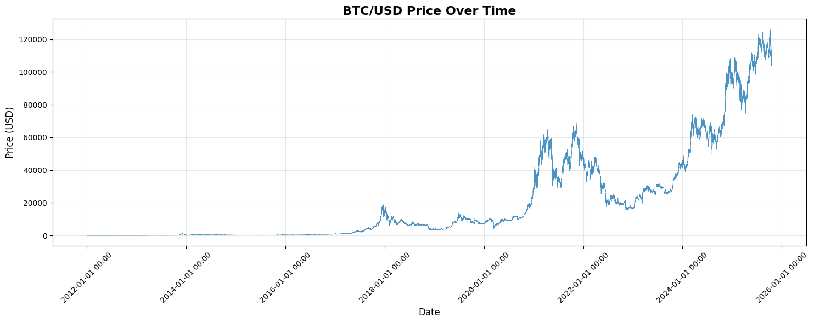
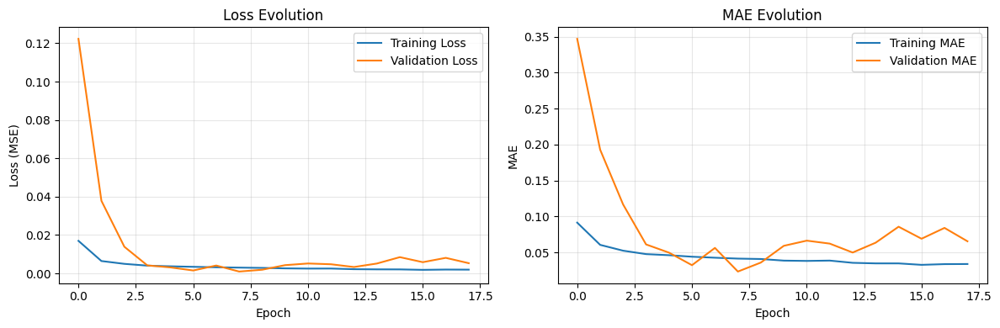
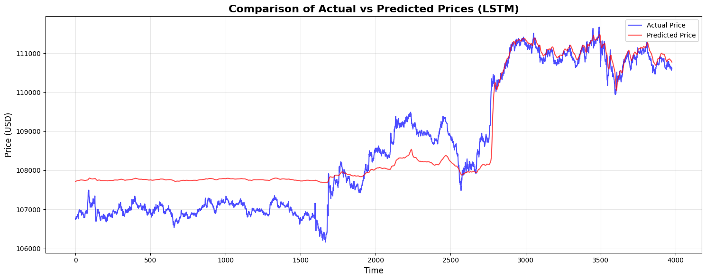
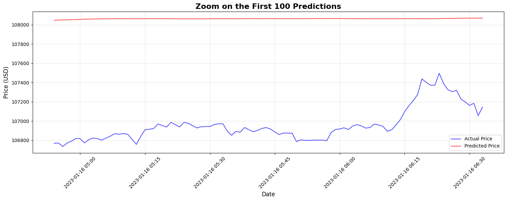
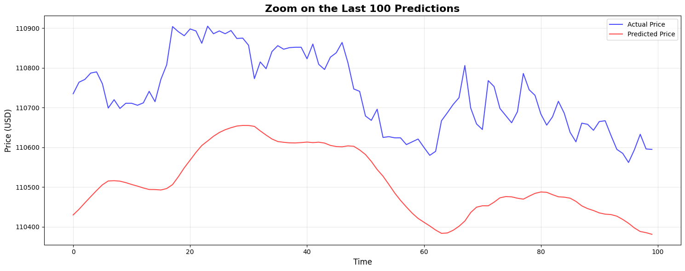

# LSTM Bitcoin Price Prediction

Projet de prédiction des prix du Bitcoin (BTC/USD) utilisant un modèle LSTM profond combiné avec des couches de convolution et des connexions résiduelles.

## Graphiques Générés

### 1. Historique des Prix BTC/USD

*Historique complet des prix du Bitcoin avec les statistiques (min, max, moyenne, écart-type)*

### 2. Évolution de l'Entraînement

*Évolution de la perte (MSE) et de l'erreur absolue moyenne (MAE) pendant l'entraînement*

### 3. Prédictions Complètes

*Comparaison des prix réels vs prédits sur l'ensemble du dataset de test*

### 4. Zoom sur les 100 Premières Prédictions

*Détail des 100 premières prédictions pour une meilleure visualisation de la précision*

### 5. Zoom sur les 100 Dernières Prédictions

*Détail des 100 dernières prédictions du modèle*

## 🛠️ Architecture du Modèle

- **Input**: Séquences de 120 points de temps (120 minutes)
- **Conv1D Blocks**: 2 blocs de convolution 1D avec normalisation par batch
- **Connexions Résiduelles**: Pour éviter la dégradation du gradient
- **LSTM Layers**: 3 couches LSTM avec dropout (100, 80, 60 unités)
- **Dense Layers**: Couches de densité avec activation ReLU
- **Output**: Prédiction du prix suivant

## Métriques de Performance

Les métriques sont affichées lors de l'exécution:
- **MSE** (Mean Squared Error)
- **MAE** (Mean Absolute Error)
- **RMSE** (Root Mean Squared Error)
- **R² Score**

## Utilisation


Les graphiques seront automatiquement enregistrés dans le dossier `images/` et les logs TensorBoard dans `logs/`.

## Structure du Projet

```
IPSSI_LSTM_Crypto/
├── BitcoinLSTM.ipynb          # Notebook principal
├── best_lstm_model.keras      # Modèle pré-entraîné
├── data/
│   └── btcusd_1-min_data.csv  # Données d'entraînement
├── logs/
│   └── fit/                   # Logs TensorBoard
├── images/                    # Graphiques générés
└── README.md
```

## 🔧 Dépendances

- TensorFlow/Keras
- pandas
- NumPy
- scikit-learn
- Matplotlib

---

**Auteur**: Matis  
**Date**: Octobre 2025  
**Projet**: IPSSI - S14 Machine Learning
